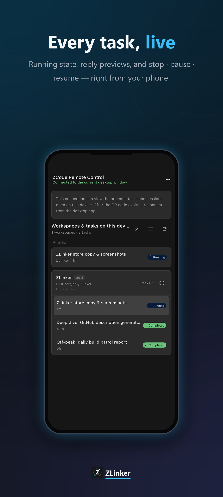
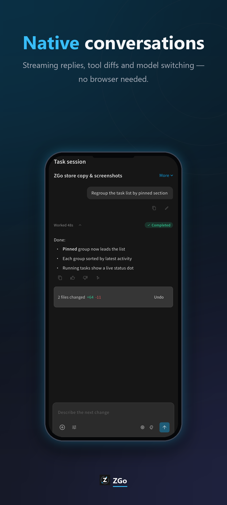
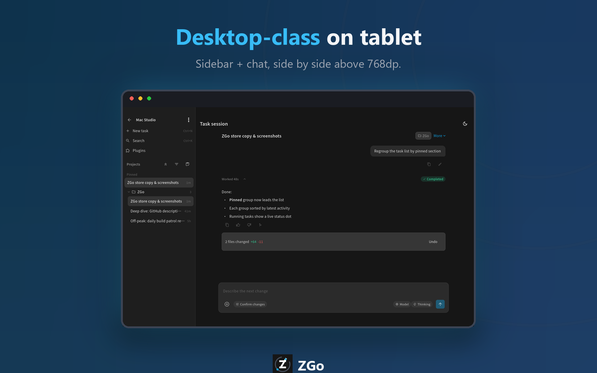

<div align="center">

# ZGo

**ZCode — to go.**

The open **ZCode remote** for your pocket — a native device list with
live online status and running-task badges, a native task list with
stop / pause / resume, and a **full native chat** built on the
Conversation V4 protocol: streaming markdown, tool cards with diffs,
model / mode / thought switching, queued messages, interactive
confirmations, attachments and history paging. The official web remote
stays one tap away as the escape hatch.

[简体中文](README.zh-CN.md) · [Why ZGo?](#-why-zgo) · [Features](#-features) · [Quick Start](#-quick-start) · [Architecture](#%EF%B8%8F-architecture)

[](https://github.com/KiMelody/ZGo/releases)
[](https://github.com/KiMelody/ZGo/actions/workflows/ci.yml)
[](#-quick-start)
[](LICENSE)
[](https://flutter.dev)
[](https://dart.dev)

</div>

---

## 💡 Why ZGo?

A coding agent that runs for twenty minutes at a time shouldn't chain
you to a desk. "ZCode from a phone" used to mean one of two raw deals:
mirror the desktop screen (unreadable at phone size, no notifications,
dies on every network blip), or open the web page in a browser (no
device status, no task list, no controls — and browser notifications
that never arrive on mobile anyway).

**ZGo bets on the hard road.** One pure-Dart protocol stack — relay
handshake, pairing proof, frame transport, the V4 conversation model —
drives everything natively: device status, the live task list, stop /
pause / resume, usage, model providers, and since 1.3 the complete chat
experience (streaming turns, commands with CAS retries, attachments,
model switching). The official web remote remains embedded as the
per-task escape hatch; when the protocol shifts, the native path
degrades gracefully into web mode and the app keeps working.

- 🟢 **Live status, free** — every device card carries an online dot
  and a running-task badge, fed by the real-time sessions-index
  subscription.
- 📋 **A real task list** — workspace cards with local badges and
  paths, task rows with phase pills and relative times, a persistent
  connection banner, a pinned group, a long-press action menu, and
  collapse / organize / refresh. Wide screens (≥768dp) switch to a
  dual-pane layout: a 264dp task rail beside an embedded chat.
- 💬 **A real conversation** — the whole V4 surface as widgets:
  grouped turns, streaming markdown, thinking strips, tool summaries
  with diffs, interactive confirmations, queued messages, feedback,
  retry / fork / rewind, slash commands and skills, the usage ring,
  history paging — plus a draft composer whose first message creates
  the task.
- 🛡 **Protocol drift can't brick it** — a failed handshake flips that
  device's card to "use the web version"; the WebView path depends on
  no protocol code at all. Every device also has an explicit
  "open web version" escape hatch, with a global toggle in settings.
- 🔐 **Credentials stay on the phone** — device URLs live in local
  storage only (Android cloud backup deliberately disabled for them);
  no servers, no analytics, no accounts.

> *Native where it counts, web where it saves.*

Finding it useful? A **Star ⭐** keeps you posted.

---

## ✨ Features

| | |
|---|---|
| 📱 **Device list** | Cards with device name / host / last used / online status dot / running-task badge; drag-reorder and pin; rename, delete, copy link, open in browser; clipboard offer-to-add; device backup as JSON export / import |
| ➕ **Pair by QR / paste / screenshot** | Camera scan (`mobile_scanner`), pure-Dart gallery decode (`zxing2`), pasted links; automatic dedupe; unparseable links are still saved, never lost |
| 📊 **Native task list** | Workspace cards (local badge, path, updated time, task count) with phase-pill rows (spinner / ✓ / failed), relative times, current-task highlight; persistent connection banner; pinned group; long-press bottom menu (stop / pause / resume); collapse / organize / refresh; ≥768dp dual-pane (264dp rail + embedded chat) |
| 👉 **Swipe trays** | Swiping a task row reveals quick actions (archive / mark unread / delete) — the same verbs as the long-press menu, no menu needed |
| 💬 **Native chat** | Full Conversation V4: grouped turns with streaming markdown, thinking strips, tool summaries + diffs, file-change bars with rewind, feedback (👍/👎/fork), interactive confirmations (permissions and questions), queued messages with auto-send, model / mode / thought / follow-up switching, attachments, slash commands + `$Skills`, usage ring, context bar, history paging, takeover mask, long-press actions (retry / edit-resend / fork / rewind) |
| 🖼️ **Chat file preview** | Inline markdown images, a fullscreen image viewer, and markdown / HTML dual views — served straight from the desktop `file` channel |
| 🛰️ **Sub-agents, live** | Running sub-agents stream inside the conversation; one tap opens that sub-agent's session as a read-only replay |
| 📴 **Offline replay queue** | Commands that fail while offline enter a replayable queue and drain automatically on reconnect |
| 🆕 **Draft composer** | Start a new task straight from a workspace ➕: pick model / mode / thought level, and the first message rides along with `createSession` |
| 🧭 **New-task defaults** | Default permission mode / model / thought level for every new task, three-tier fallback (per-message → global default → follow desktop); dedicated settings page |
| 🎯 **Web escape hatch** | Any task can hop into the official web remote (park → deep-link injection → resume); the native path never parks the connection on its own |
| 📈 **Usage & entitlements** | Per-device snapshot of remaining quota, limits and subscription tier, plus model-provider management over the workspace bridge |
| 🧩 **Model providers** | Providers and endpoints managed on the phone, including the advanced per-model configuration section |
| 🖥️ **Desktop settings** | Flip desktop-side settings remotely (interaction behavior, task auto-archive) |
| 🤖 **Server automations** | Desktop-side schedules (cron / recurring interval / one-shot delay) with full CRUD: humanized trigger summaries, enable toggles, edit / delete confirmations — fired by the desktop scheduler, no need for the phone to be online |
| 🌙 **Off-peak tasks** | Submit queue jobs for free compute windows: live queue position (#N), pause / resume / cancel, duration history, the official subscription / quota / unavailable states, "view result" deep-links; three quick templates built in |
| 🔔 **Local notifications** | Task finished / failed, off-peak results, automation runs — four separately-silenceable channels; tapping lands in the **native chat** (the web remote's browser notifications never reach a phone) |
| 📶 **Quota watch** | Resident low-quota notification (progress ring + remaining %) with one-tap reset, plus in-chat bottleneck alerts when a turn stalls on quota |
| 🔋 **Keep-alive (Android)** | Optional foreground service holds the relay link so task / off-peak / quota notifications keep flowing in the background |
| ⏰ **Scheduled messages** | An in-app timer plus `createSession`: send a message to a chosen device at a chosen time, even if the device looks offline — complements server automations |
| 🧮 **Home widget** | Android home-screen widget that jumps straight into a device |
| ⚙️ **Settings & about** | Theme (dark / light / system), 中文 / English, native-list toggle, channel-aware update check, open-source licenses, privacy policy, local usage stats |
| 🌐 **In-app web remote** | Fullscreen `flutter_inappwebview` with a loading progress bar, refresh, and an open-in-browser escape hatch; DOM storage preserves the official page's pairing state |
| 🎨 **Design tokens** | The neutral-gray + sky-blue token set extracted from the desktop bundle; dark `#161616` by default |
| 📱 **Android + iOS** | Release builds for both platforms, privacy manifests, bilingual permission strings; no build ships in-app APK download / install code |
| 🔄 **Landscape** | Chat and bottom sheets adapt to landscape phones and half-open foldables: collapsing tool rows, fixed-height sheets that no longer overflow |

One terminal per device: the server allows a single remote connection
per device. The native chat holds that link for its whole lifetime;
only "open web version" parks it, and it reconnects about a second
after the WebView closes. Multiple desktops run side by side, each
with a connection of its own.

---

## 📸 Screenshots

<p align="center">
  
  
</p>

<p align="center">
  
</p>

Task list → conversation, plus the ≥768dp dual-pane layout (task rail +
chat). Everything above is the **native Flutter app** (see
`docs/store/SCREENSHOTS.md`); the native UI follows the official
remote-control layout — same token set, same breakpoints, same
structure.

---

## 🚀 Quick Start

You need a desktop running **ZCode** (zcode.z.ai). Generate the remote
link there: ZCode → Remote Control → QR code / copy link, shaped like:

```text
https://zcode.z.ai/remote/v4?sid=...&hash=...&t=...&mid=...&name=...
```

### Option A · Download the APK

Fetch the latest APK from
[Releases](https://github.com/KiMelody/ZGo/releases), install it, and
scan the desktop QR to add your first device.

> ⚠️ Only install APKs from sources you trust — a remote link is a
> device credential. Audit the code, or use Option B and build it
> yourself.

### Option B · Build from source

Prerequisites: [Flutter](https://docs.flutter.dev/get-started/install)
3.44+ (Dart 3.12+; the `pubspec.yaml` floor stays 3.4 for the
OpenHarmony SIG fork). Building for Android needs JDK + Android SDK;
iOS needs a Mac + Xcode.

```bash
git clone https://github.com/KiMelody/ZGo.git
cd ZGo
flutter pub get

flutter run                       # debug against a device

flutter build apk --release       # the default channel
flutter build ipa                 # requires a Mac
```

The update check polls GitHub Releases and opens the browser to
download. No build ships in-app APK download or install logic.

In the app: **Add device** → scan or paste → tap the card → the native
task list → tap a task → the native chat.

```bash
flutter analyze   # analyzer stays silent
flutter test      # all green, protocol tests included
```

---

## 🧱 Architecture

```
┌─────────────────────────────────────────────────────────────┐
│ UI (lib/ui)                                                 │
│   three primary pages: devices, tasks, chat/ —              │
│   the chat family (viewers, previews, feed) ·               │
│   automations · off-peak ·                                  │
│   the settings family (general / desktop /                  │
│   providers / defaults) · usage & stats ·                   │
│   scheduled · qr scan · quota reset                         │
│                                                             │
├─────────────────────────────────────────────────────────────┤
│ State (lib/state)                                           │
│   device_store — device records, persistence, backup        │
│   device_session — the connection lifecycle machine         │
│                    (establish / yield / resume / backoff,   │
│                     a ChatGateway seam for the chat page)   │
│   task_directory — one merged task view                     │
│   quota_watch · quota_reset · entitlement_poller —          │
│                    the low-quota watch and one-tap reset    │
│   new_task_defaults — assembling default args               │
│   scheduled_store — messages + their scheduler              │
│   notification_hub — three event kinds become               │
│                      phone notifications                    │
├─────────────────────────────────────────────────────────────┤
│ Protocol (lib/protocol — pure Dart, unit-tested)            │
│   conversation (V4) · the relay / remote clients ·          │
│   channel RPC · frame transport · codecs · proof ·          │
│   the automation / off-peak / task-command ports ·          │
│   file service · model & provider ports ·                   │
│   direct fetches · method_probe (names are                  │
│   probed at runtime, never hardcoded)                       │
├─────────────────────────────────────────────────────────────┤
│ Notifications (lib/notifications)                           │
│   notification_service — channels, permissions,             │
│                           tap payloads                      │
│   keepalive_controller — the foreground-service switch      │
│   phase_snapshot_store — baselines persisted                │
│   quota_watch_presenter — the resident quota bar            │
│   notify_rules — snapshots in, events out (pure)            │
├─────────────────────────────────────────────────────────────┤
│ Web fallback layer (remote_page)                            │
│   a WebView hosting the official ZCode web remote,          │
│   plus an injected deep link to the tapped session          │
│   — deliberately zero protocol dependencies                 │
└─────────────────────────────────────────────────────────────┘

```

```text
lib/
├── main.dart                     # wiring: stores, session hub, scheduler,
│                                 #       + notification center & tap routing
├── protocol/                     # the ZCode remote protocol, pure Dart
│   ├── relay_client.dart         # long-lived relay socket: auth, proof, keepalive, reconnect
│   ├── remote_client.dart        # bootstrap, bridge, recovery, view state
│   ├── conversation.dart         # the V4 session layer: index, commands, deltas
│   ├── channel_client.dart       # RPC layer over IPC channels
│   ├── automation.dart           # automation CRUD port (runtime method probing)
│   ├── off_peak.dart             # off-peak port and its error taxonomy
│   ├── task_commands.dart        # rename / pin / archive / unread ops (probed)
│   ├── method_probe.dart         # probe channel method names until one is accepted
│   ├── file_service.dart         # desktop file channel feeding chat preview
│   ├── task_groups.dart          # grouped task views with token usage (probed)
│   ├── model_selection.dart      # read-only port to the model registry
│   ├── provider_settings.dart    # model-provider management port
│   ├── endpoint_models.dart      # pull /models directly, bypassing the bridge
│   ├── rpc_transport.dart        # rpc frame chunking with checksums
│   ├── ipc_codec.dart            # encode/decode values, parse frame boundaries
│   ├── connection_params.dart    # parse the pairing link, derive the relay url
│   ├── id.dart · proof.dart · crc32.dart · device_info.dart
├── state/
│   ├── device_store.dart         # device records, persistence, backup import/export
│   ├── device_session.dart       # session + hub: one terminal per device
│   │                             #   hosting surface for automation/off-peak
│   ├── task_directory.dart       # one task view merging relay and live streams
│   ├── entitlement_poller.dart   # poll entitlement snapshots, gate by phase
│   ├── quota_watch.dart          # hysteresis for the low-quota verdict
│   ├── quota_reset.dart          # one-tap quota reset via reset pools
│   ├── new_task_defaults.dart    # assemble new-task defaults (pure functions)
│   ├── scheduled_store.dart      # scheduled messages and their scheduler
│   └── notification_hub.dart     # turns three event kinds into notifications
├── notifications/
│   ├── notification_service.dart # channels, permissions, tap payloads
│   ├── keepalive_controller.dart # the Android foreground keep-alive service
│   ├── phase_snapshot_store.dart # phase baselines persisted on disk
│   ├── quota_watch_presenter.dart# the resident quota bar and its actions
│   └── notify_rules.dart         # pure rules deriving events from snapshots
├── ui/
│   ├── theme.dart                # the token set and both themes
│   ├── ui_settings.dart          # locale, toggles, and the tr() lexicon
│   ├── devices_page.dart         # device cards: status dot, task badges
│   ├── task_list_page.dart       # the task directory page (mobile layout)
│   ├── chat/chat_page.dart       # the chat page (full V4 surface)
│   ├── chat/markdown_view.dart   # markdown rendering, copyable code blocks
│   ├── chat/diff_view.dart       # extract diffs from tool calls, render them
│   ├── chat/file_preview_page.dart # markdown / HTML dual preview
│   ├── chat/image_viewer_page.dart # the fullscreen image viewer
│   ├── chat/subagent_feed.dart   # the live sub-agent feed
│   ├── chat/subagent_detail_page.dart # a sub-agent session, read-only
│   ├── chat/mention_sheet.dart   # the @ mention picker sheet
│   ├── chat/goal_panel.dart      # goal and plan progress panel
│   ├── remote_page.dart          # the web fallback page with deep links
│   ├── automations_page.dart     # the server automations page
│   ├── off_peak_page.dart        # off-peak page: queue, quota, results
│   ├── settings / about / usage_stats (three pages)
│   ├── device_usage · model_providers (two pages)
│   ├── provider_settings_page.dart # the provider management page
│   ├── new_task_defaults_page.dart # the defaults editor page
│   ├── desktop_settings_page.dart # flip desktop settings, safe subset only
│   ├── scheduled · qr_scan (two pages)
│   ├── quota_reset_dialog.dart   # the quota reset confirmation dialog
│   └── widgets/ (device_name · dropdown_field · sheet_scaffold · swipe_actions)
├── widgets/                      # the bridge to the Android home widget
└── update/                       # channel define + release check
```

---

## 🤝 Contributing

Issues and PRs are both welcome. Before you submit:

```bash
flutter analyze   # analyzer stays silent
flutter test      # must be all green
```

Small, focused PRs land fastest. UI changes should keep the [design
tokens](lib/ui/theme.dart) — they are the project's visual backbone.
Protocol changes should ship with tests.

---

## 🙏 Acknowledgements

- **ZCode and the official web remote** — the protocol capability and
  the fallback experience both live there.
- The Flutter ecosystem: `flutter_inappwebview`, `mobile_scanner`,
  `zxing2`, `shared_preferences`, `url_launcher`, `web_socket_channel`,
  `flutter_local_notifications`, `flutter_markdown`, `markdown`,
  `file_picker`, `image_picker`, `image`, `home_widget`, `app_links`,
  `package_info_plus`, `http`.

> ⚠️ ZGo is an independent community tool, not affiliated with,
> endorsed by, or connected to Zhipu AI. Use it only with devices you
> own and in accordance with the ZCode terms of service.

[Privacy Policy](https://privacy.songsong.org/en.html) · [Terms of Service](https://privacy.songsong.org/tos-en.html)

---

## License

MIT © ZGo contributors — see [LICENSE](LICENSE).
