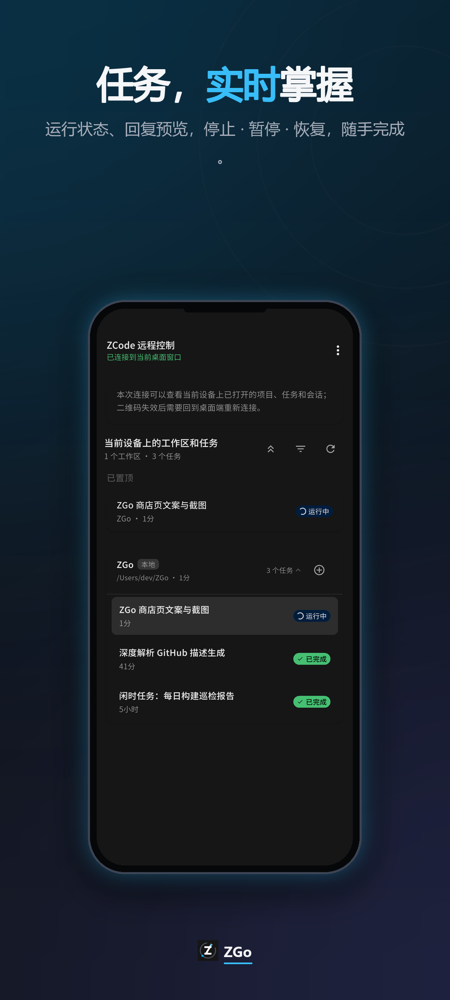
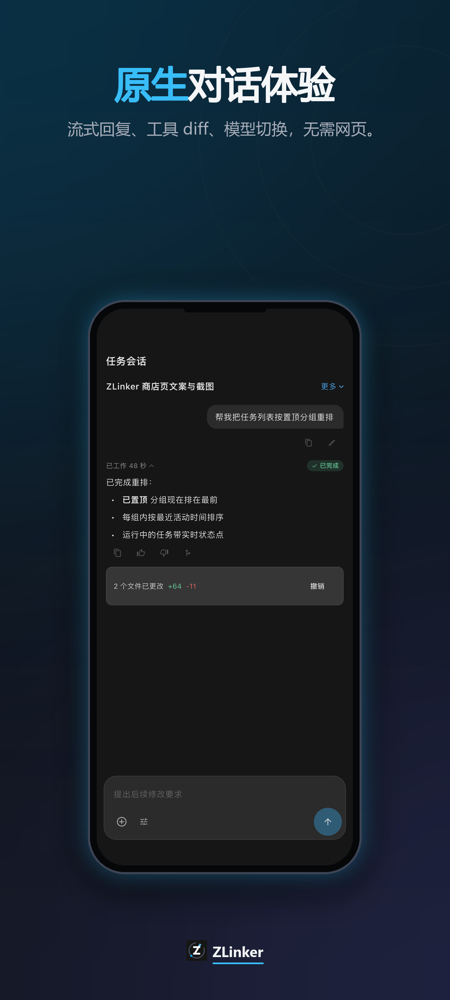
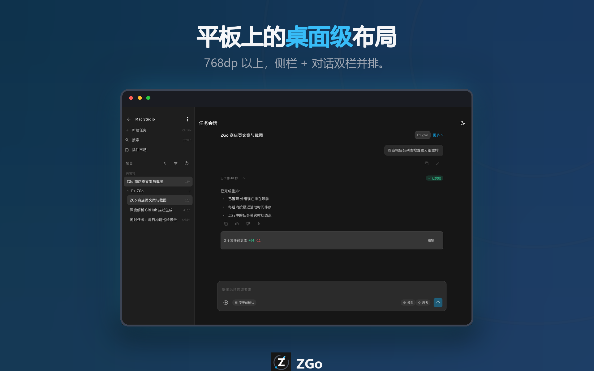

<div align="center">

# ZGo

**ZCode — to go.**

开源的 **ZCode 随身客户端** —— 原生设备列表实时显示在线状态与正在
运行的任务,任务列表支持停止 / 暂停 / 恢复;对话基于 Conversation V4
协议完整原生实现:流式 markdown、带 diff 的工具卡片、模型 / 模式 /
思考等级随切随用,排队消息、交互确认、附件与历史翻页一应俱全。
官方 Web 远程内嵌于应用中,随时可作退路。

[English](README.md) · [为什么做 ZGo?](#-为什么做-zgo) · [功能](#-功能) · [快速开始](#-快速开始) · [架构](#%EF%B8%8F-架构)

[](https://github.com/KiMelody/ZGo/releases)
[](https://github.com/KiMelody/ZGo/actions/workflows/ci.yml)
[](#-快速开始)
[](LICENSE)
[](https://flutter.dev)
[](https://dart.dev)

</div>

---

## 💡 为什么做 ZGo?

一跑就是二十分钟的编码智能体,不该把人拴在书桌前。想在手机上用
ZCode,过去只有两个将就的选法:要么镜像桌面屏幕 —— 手机上看不清,
没有通知,网络一抖就断;要么用浏览器开网页版 —— 没有设备状态、
没有任务列表、没有控制,而浏览器通知在手机上本来就收不到。

**ZGo 选择把难走的路走通。**relay 握手、配对证明、帧传输、V4 会话
模型,整套协议用纯 Dart 从零实现,原生驱动一切:设备在线状态、实时
任务列表、停止 / 暂停 / 恢复、用量、模型供应商,以及 1.3 起的完整
对话体验(流式输出、带 CAS 重试的命令、附件、模型切换)。官方 Web
远程原样内嵌,作为每个任务的退路;协议变动时,原生路径自动降级为
网页模式,App 照常能用。

- 🟢 **状态免费送** —— 每张设备卡自带在线状态点与运行中任务徽标,
  数据直接来自 sessions-index 的实时订阅。
- 📋 **一个像样的任务列表** —— 移动端布局照官方远程来做:工作区
  卡片挂本地徽标与路径,任务行带状态药丸和相对时间;连接状态横幅
  常驻,置顶任务单独成组;长按任务弹出操作菜单,收起、整理、刷新
  都在手边;宽屏(≥768dp)自动切成双栏——左边 264dp 任务列表,
  右边内嵌对话。
- 💬 **一个完整的对话页** —— V4 的能力全部落成组件:分组 turn、
  流式 markdown、思考过程折叠、带 diff 的工具摘要、交互确认、排队
  消息、点赞点踩、重试 / 分叉 / 回滚、斜杠命令与 Skills、用量环、
  历史翻页——外加一个草稿输入框,首条消息发出去,任务就建好了。
- 🛡 **协议怎么变都不慌** —— 握手失败时,那张设备卡会提示改用网页
  版;WebView 这条路径完全不碰协议代码。每张卡也有显式的「网页版
  打开」,设置里还有原生列表总开关。
- 🔐 **凭据不出手机** —— 设备 URL 只落在本地存储(Android 特意
  为它关掉云备份);没有服务器、没有埋点、没有账号。

> *能原生的原生,要兜底的有网页。*

用着顺手就点个 **Star ⭐**,更新不迷路。

---

## ✨ 功能

| | |
|---|---|
| 📱 **设备列表** | 卡片上有设备名、主机、上次使用时间、在线状态点和运行中任务徽标;可拖拽排序、置顶;支持重命名、删除、复制链接、在浏览器打开;检测到剪贴板里的远程链接会主动提示添加;设备可整体备份为 JSON,导出导入都行 |
| ➕ **扫码 / 粘贴 / 截图添加** | 相机扫码(`mobile_scanner`)、相册截图识码(`zxing2`,纯 Dart)、粘贴链接三管齐下;自动去重;解析不了的链接也照样保存,绝不丢 |
| 📊 **原生任务列表** | 工作区卡片带本地徽标、路径、更新时间与任务数;任务行有状态药丸(转圈 / ✓ / 失败)、相对时间,当前任务高亮;连接状态横幅常驻;置顶任务成组;长按任务弹底部菜单(停止 / 暂停 / 恢复);支持收起全部、整理、刷新;≥768dp 自动双栏(264dp 侧栏 + 内嵌对话) |
| 👉 **左滑快捷操作** | 任务行往左一滑,归档 / 标记未读 / 删除直接露出——和长按菜单同一组操作,不用进菜单 |
| 💬 **原生对话** | Conversation V4 全量:分组 turn 流式 markdown、思考折叠、工具摘要与 diff、可撤销的文件变更条、反馈(👍/👎/分叉)、权限与提问的交互确认、排队消息自动发送、模型 / 模式 / 思考 / 后续消息切换、附件、斜杠命令 + `$Skills`、用量环、上下文条、历史翻页、被接管遮罩,长按还有重试 / 编辑重发 / 分叉 / 回滚 |
| 🖼️ **对话内文件预览** | markdown 里内联图片、全屏图片查看器、文件的 markdown / HTML 双视图——数据直接取自桌面 `file` 通道 |
| 🛰️ **子智能体实时动态** | 运行中的子智能体在对话流里实时滚出;点一下,进入它那个会话的只读回放 |
| 📴 **离线补发队列** | 断网期间发不出去的命令先排队,一重连就自动补发,不用重敲 |
| 🆕 **草稿输入** | 在工作区点 ➕ 直接开新任务:先挑模型 / 模式 / 思考等级,首条消息随 `createSession` 一起发出 |
| 🧭 **新任务默认值** | 为所有新任务设默认权限模式 / 模型 / 思考等级,三级回退(单条消息 → 全局默认 → 跟随桌面);有专门的设置页 |
| 🎯 **随时退回网页** | 任何任务都能从菜单跳进官方 Web 远程(挂起 → 注入直达 → 恢复);原生这条路全程不让出连接 |
| 📈 **用量与权益** | 按设备查看权益快照:剩余额度、配额上限、订阅档位;模型供应商在工作区 bridge 上直接管理 |
| 🧩 **模型供应商** | 供应商与端点都在手机上管理,还有逐模型的高级配置区 |
| 🖥️ **桌面端设置** | 交互行为、任务自动归档这类桌面端设置,躺在沙发上就能改 |
| 🤖 **服务端自动化** | 桌面侧的定时任务(cron / 固定间隔 / 一次性延时),增删改查齐全:触发时间用自然语言概括,可启停,编辑 / 删除都有确认;由桌面调度进程触发,手机在不在线都照跑 |
| 🌙 **闲时任务** | 把任务排进算力空闲的免费时段:排队位次(#N)实时更新,可暂停 / 继续 / 取消;历史带耗时;订阅、额度、暂不可用三种官方状态都有对应文案;「查看结果」直达产出会话;附三个快捷模板 |
| 🔔 **本地通知** | 任务完成 / 失败、闲时结果、自动化触发,都会推到手机;四条渠道可分别静音;点通知直达**原生对话**——Web 远程的浏览器通知,在手机上是收不到的 |
| 📶 **额度监控** | 低额度常驻通知带进度环和剩余百分比,一键就能重置;回合被额度卡住时,对话里也会提醒 |
| 🔋 **前台保活(Android)** | 可选的前台服务把 relay 连接攥在手里,后台照样收任务 / 闲时 / 额度通知 |
| ⏰ **本地定时发送** | 应用内定时器 + `createSession`,到点给指定设备发消息;目标设备看着离线也不影响,正好和服务端自动化互补 |
| 🧮 **桌面小组件** | Android 桌面小组件,一按直达设备 |
| ⚙️ **设置与关于** | 主题(深 / 浅 / 跟随系统)、语言(中文 / English)、原生列表开关、按渠道的检查更新、开源许可、隐私政策、本地使用统计 |
| 🌐 **应用内远程页** | 全屏 `flutter_inappwebview`,带加载进度条、刷新和「在浏览器中打开」;DOM Storage 保得住官方页的配对状态 |
| 🎨 **官方设计 token** | 从官方 bundle 提取的中性灰 + 天空蓝;深色 `#161616` 默认 |
| 📱 **Android + iOS** | 双平台发布构建、隐私清单、双语权限文案;任何构建都不含应用内下载安装 APK 的代码 |
| 🔄 **横屏适配** | 对话与底部弹层适配横屏手机和折叠屏半开形态:工具行收拢,固定高度的弹层不再溢出 |

服务端给每台设备只留一个终端位:原生界面全程占着,从不断开;只有
显式的「网页版打开」才让位,WebView 关闭后约一秒自动收回。多台桌面
互不干扰,一人一位。

---

## 📸 截图

<p align="center">
  
  
</p>

<p align="center">
  
</p>

任务列表 → 对话,以及 ≥768dp 的双栏布局(侧栏 + 对话)。以上均为
**Flutter 原生 App** 界面(见 `docs/store/SCREENSHOTS.md`);原生 UI
跟随官方远程控制的布局——同一套 token、同样的断点与结构。

---

## 🚀 快速开始

你需要一台跑着 **ZCode**(zcode.z.ai)的桌面设备。在那边生成远程
链接:ZCode → 远程控制 → 二维码 / 复制链接,长这样:

```text
https://zcode.z.ai/remote/v4?sid=...&hash=...&t=...&mid=...&name=...
```

### 方式 A · 直接下载 APK

到 [Releases](https://github.com/KiMelody/ZGo/releases) 取最新 APK
装上,再扫桌面二维码,第一台设备就加好了。

> ⚠️ 只装信得过来源的 APK——远程链接等同于设备凭据。不放心就审查
> 代码,或者用方式 B 自己构建。

### 方式 B · 源码构建

前置条件:[Flutter](https://docs.flutter.dev/get-started/install)
3.44+(Dart 3.12+;`pubspec.yaml` 下限留在 3.4,为 OpenHarmony SIG
fork 构建留的)。构建 Android 要 JDK + Android SDK;构建 iOS 要
Mac + Xcode。

```bash
git clone https://github.com/KiMelody/ZGo.git
cd ZGo
flutter pub get

flutter run                       # 真机调试

flutter build apk --release       # 默认渠道
flutter build ipa                 # 需在 Mac 执行
```

「检查更新」会查询 GitHub Releases,然后跳到浏览器下载。任何构建都
不含应用内下载安装 APK 的代码。

应用里:**添加设备** → 扫码或粘贴 → 点卡片 → 原生任务列表 → 点任务
→ 原生对话。

```bash
flutter analyze   # 必须零告警
flutter test      # 必须全绿,含协议层单测
```

---

## 🧱 架构

```
┌─────────────────────────────────────────────────────────────┐
│ UI (lib/ui)                                                 │
│   设备 / 任务 / 对话三个主页 · chat/ 一族(预览、            │
│   查看器、子智能体动态) · 自动化 · 闲时 ·                   │
│   各设置页(通用 / 桌面端 / 供应商 /                         │
│   默认值) · 用量统计 · 定时 ·                               │
│   扫码 · 额度重置                                           │
├─────────────────────────────────────────────────────────────┤
│ State (lib/state)                                           │
│   device_store — 设备记录、持久化与备份                     │
│   device_session — 连接生命周期状态机                       │
│                    (建链 / 让位 / 恢复 / 退避,              │
│                     ChatGateway 接缝留给对话页)             │
│   task_directory — 任务总览的合并视图                       │
│   quota_watch / reset / entitlement 轮询 —                  │
│                      低额度警戒与一键重置                   │
│   new_task_defaults — 默认参数组装                          │
│   scheduled_store — 定时消息与到点触发                      │
│   notification_hub — 三类事件汇成本地通知                   │
├─────────────────────────────────────────────────────────────┤
│ Protocol (lib/protocol — 纯 Dart,经真机验证)                │
│   conversation (V4) · relay / remote 客户端 ·               │
│   通道 RPC · 帧传输 · 编解码 · 配对证明 ·                   │
│   自动化 / 闲时 / 任务命令 / 分组视图 各端口 ·              │
│   文件服务 · 模型与供应商端口 ·                             │
│   直连拉取 · method_probe (方法名一律                       │
│   运行时探测,绝不硬编码)                                    │
├─────────────────────────────────────────────────────────────┤
│ Notifications (lib/notifications)                           │
│   notification_service — 渠道、权限与点击载荷               │
│   keepalive_controller — 前台保活开关                       │
│   phase_snapshot_store — 阶段基线落盘                       │
│   quota_watch_presenter — 额度常驻条                        │
│   notify_rules — 纯函数:比较快照、产出事件                  │
├─────────────────────────────────────────────────────────────┤
│ 网页兜底层 (remote_page)                                    │
│   内嵌 ZCode 官方 Web 远程的容器                            │
│   + 深链注入,点击直达所选会话                               │
│   —— 刻意做到零协议依赖                                     │
└─────────────────────────────────────────────────────────────┘

```

```text
lib/
├── main.dart                     # 启动时的装配:各 store、会话 hub 与调度器
│                                 #       + 通知中心与点击路由
├── protocol/                     # ZCode 远程协议的纯 Dart 实现
│   ├── relay_client.dart         # relay wss 长连:鉴权、配对、保活、自动重连
│   ├── remote_client.dart        # 引导、bridge、断线恢复、视图状态
│   ├── conversation.dart         # V4 会话层:索引订阅、命令与增量
│   ├── channel_client.dart       # IPC 通道的 RPC 调用层
│   ├── automation.dart           # 自动化增删改查端口(方法名运行时探测)
│   ├── off_peak.dart             # 闲时任务端口与错误态归类
│   ├── task_commands.dart        # 任务的改名/置顶/归档/未读操作(带探测)
│   ├── method_probe.dart         # 方法名探测:逐候选尝试直至接受
│   ├── file_service.dart         # 桌面 file 通道,供对话内文件预览
│   ├── task_groups.dart          # 任务分组视图与 token 用量(带探测)
│   ├── model_selection.dart      # 模型注册表的只读通道
│   ├── provider_settings.dart    # 模型供应商管理通道
│   ├── endpoint_models.dart      # 绕过 bridge 直拉 /models
│   ├── rpc_transport.dart        # rpc 帧分片与校验和
│   ├── ipc_codec.dart            # 帧内值编解码与帧界解析
│   ├── connection_params.dart    # 解析远程链接并推导 relay 地址
│   ├── id.dart · proof.dart · crc32.dart · device_info.dart
├── state/
│   ├── device_store.dart         # 设备的定义、本地存取与备份
│   ├── device_session.dart       # 会话与 hub:每设备独占一个终端
│   │                             #   并向自动化/闲时提供宿主接口
│   ├── task_directory.dart       # 合并 relay 与 live 两路的任务总览
│   ├── entitlement_poller.dart   # 轮询权益快照并判定阶段
│   ├── quota_watch.dart          # 额度不足的滞回判定
│   ├── quota_reset.dart          # 额度一键重置(按重置池映射)
│   ├── new_task_defaults.dart    # 组装新任务默认参数(纯函数)
│   ├── scheduled_store.dart      # 定时消息与到点调度器
│   └── notification_hub.dart     # 三类事件汇聚为本地通知
├── notifications/
│   ├── notification_service.dart # 通知四渠道、权限与点击载荷
│   ├── keepalive_controller.dart # 安卓前台保活服务
│   ├── phase_snapshot_store.dart # 阶段基线持久化
│   ├── quota_watch_presenter.dart# 额度常驻通知及其操作
│   └── notify_rules.dart         # 纯函数:比较前后快照,得出事件
├── i18n/
│   └── lexicon.dart              # _zh/_en 词条双表与纯取值函数
├── ui/
│   ├── theme.dart                # 设计 token 与深浅两套主题
│   ├── ui_settings.dart          # 语言与开关设置;tr()/trP() 取值包装
│   ├── devices_page.dart         # 设备卡片:状态点与任务徽标
│   ├── task_list_page.dart       # 任务目录页(移动端布局)
│   ├── chat/chat_page.dart       # 对话主页(V4 全能力)
│   ├── chat/markdown_view.dart   # markdown 渲染与代码块复制
│   ├── chat/diff_view.dart       # 从工具调用提取并渲染 diff
│   ├── chat/file_preview_page.dart # 文件预览的 markdown/HTML 双视图
│   ├── chat/image_viewer_page.dart # 图片全屏查看
│   ├── chat/subagent_feed.dart   # 子智能体动态信息流
│   ├── chat/subagent_detail_page.dart # 子智能体会话的只读回放
│   ├── chat/mention_sheet.dart   # @ 提及的选择面板
│   ├── chat/goal_panel.dart      # 计划与目标进度面板
│   ├── remote_page.dart          # 网页兜底页与深链注入
│   ├── automations_page.dart     # 服务端自动化管理页
│   ├── off_peak_page.dart        # 闲时任务页:排队、额度、结果
│   ├── settings / about / usage_stats (三个页面)
│   ├── device_usage · model_providers (两个页面)
│   ├── provider_settings_page.dart # 模型供应商管理页
│   ├── new_task_defaults_page.dart # 新任务默认值编辑页
│   ├── desktop_settings_page.dart # 远程改桌面端设置(仅安全项)
│   ├── scheduled · qr_scan (两个页面)
│   ├── quota_reset_dialog.dart   # 额度重置的确认对话框
│   └── widgets/ (device_name · dropdown_field · sheet_scaffold · swipe_actions)
├── widgets/                      # 桌面小组件的桥接层
└── update/                       # 渠道定义与 GitHub 版本检查
```

---

## 🤝 贡献

Issue 与 PR 都欢迎。合并前请先跑:

```bash
flutter analyze   # 必须零告警
flutter test      # 必须全绿
```

小而聚焦的 PR 最快被合并。UI 改动请守住[设计 token](lib/ui/theme.dart)
—— 这是本项目的立身之本;协议改动请一并附上测试。

---

## 🙏 致谢

- **ZCode 及其 Web 远程** —— 协议对话能力与兜底体验的来源。
- Flutter 生态:`flutter_inappwebview`、`mobile_scanner`、`zxing2`、
  `shared_preferences`、`url_launcher`、`web_socket_channel`、
  `flutter_local_notifications`、`flutter_markdown`、`markdown`、
  `file_picker`、`image_picker`、`image`、`home_widget`、`app_links`、
  `package_info_plus`、`http`。

> ⚠️ ZGo 是独立的社区工具,与智谱 AI 无任何隶属、背书或关联。请仅
> 用于你自己的设备,并遵守 ZCode 服务条款。

[隐私政策](https://privacy.songsong.org/zh.html) · [服务条款](https://privacy.songsong.org/tos.html)

---

## 许可证

MIT © ZGo contributors —— 详见 [LICENSE](LICENSE)。
